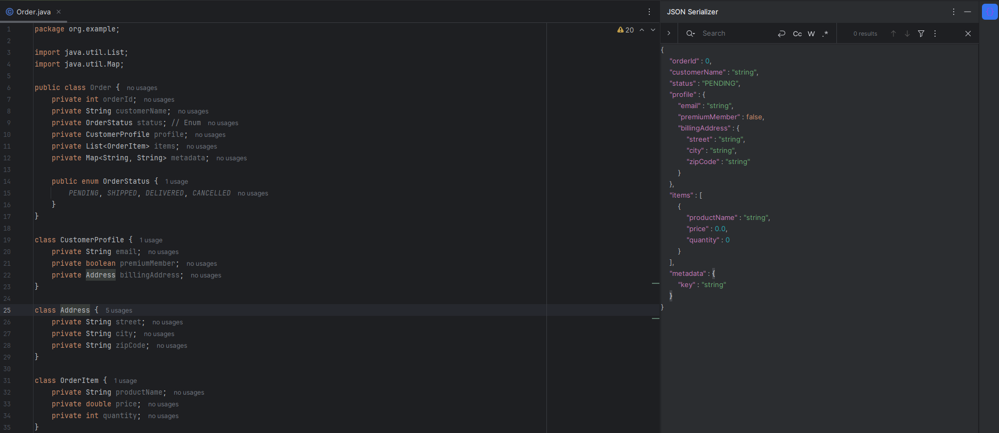

# Java2JSON

[](https://opensource.org/licenses/Apache-2.0)



Java2JSON is a powerful and lightweight **IntelliJ IDEA plugin** that instantly converts Java POJOs into formatted JSON examples. Perfect for API documentation, testing, and debugging.

## 🚀 Features

- **Instant Serialization**: Convert any Java class to JSON with a single click via the side tool window.
- **Smart Type Mapping**:
  - Handles primitives, Wrappers, and Strings.
  - **Enum Support**: Automatically picks the first available enum constant.
  - **Collections & Maps**: Supports `List`, `Set`, and `Map` with recursive resolution.
- **Native Search Experience**: Full `Ctrl+F` (Windows/Linux) and `Cmd+F` (macOS) integration to find keys or values instantly.
- **Clean Formatting**: Generates human-readable JSON with a standard **4-space indentation**.
- **Performance Optimized**: Runs complex PSI analysis in background threads to keep your IDE smooth and responsive.
- **Cycle Detection**: Built-in protection against circular references to prevent stack overflow errors.

## 🛠 Installation

1. Open IntelliJ IDEA.
2. Go to `Settings` > `Plugins` > `Marketplace`.
3. Search for **"Java2JSON"**.
4. Click `Install` and restart the IDE if prompted.

## 📖 How to Use

1. Open the Java class file you want to serialize.
2. Click on the **Java2JSON** icon (located on the right tool window bar).
3. The JSON representation will be generated automatically.
4. **To Search**: Click inside the JSON text and press `Ctrl+F` (or `Cmd+F` on Mac). Use the arrows or `Enter` to navigate through results.

## 📋 Example Output

Given a Java class:
```java
public class User {
    private String name;
    private Status status; // Enum: ACTIVE, INACTIVE
    private List<Address> addresses;
}
```
The plugin generates:

```json
{
    "name": "string",
    "status": "ACTIVE",
    "addresses": [
        {
            "street": "string",
            "city": "string"
        }
    ]
}
```
## 📄 License

This project is licensed under the **Apache License 2.0** - see the [LICENSE](LICENSE) file for details.

## 🤝 Contributing

Contributions are welcome! Please feel free to submit a **Pull Request** or report bugs via the [Issue Tracker](https://github.com/AntoGugli/java2json/issues).

---
*Developed with ❤️ for the IntelliJ community by Antonino Enrico Guglielmino.*
